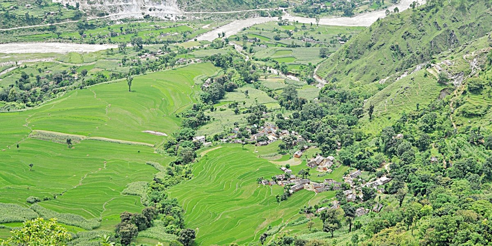

# baril-village-website
Created out of passion this is the Trusted community website for Baril Village, located in Shailyashikhar-1, Darchula, Nepal. This project aims to showcase & featuring the local culture, traditions, history, images and a helpful chatbot(M).

### ✨ Features

* **Cultural & Historical Info:** Festivals, traditions, and local heritage.
* **Location Details**  Geographic position with embedded maps.
* **Natural Beauty Showcase & maps**  Photos and descriptions of scenic spots, along with map cordinations.
* **Religious & Sacred Places**  Monasteries, temples, and worship areas.
* **Bilingual Content:** Fully supports both English and Nepali languages.
* **Responsive Design:** Looks great on desktops, tablets, and mobile phones.

### Built With

* **Frontend:** HTML5, CSS3, Vanilla JavaScript
* **Backend:** Vercel Serverless Functions
* **Maps** – Leaflet.js.
* **Database:** Vercel KV
* **Deployment:** Vercel

### License

This project is licensed under the MIT License - see the [LICENSE.md](LICENSE.md) file for details.

### Acknowledgements

A special thanks to the community of Baril for their stories and inspiration. And i sincerely thank the residents of Baril Village for their warm support, photographs, and stories that bring this site to life, as well as the local historians and elders who have preserved our culture and heritage. Special appreciation goes to the photographers whose images capture the beauty of our land, and to open-source projects like Leaflet.js for enabling interactive experiences.❤️

-By Narendra Khadayat.
